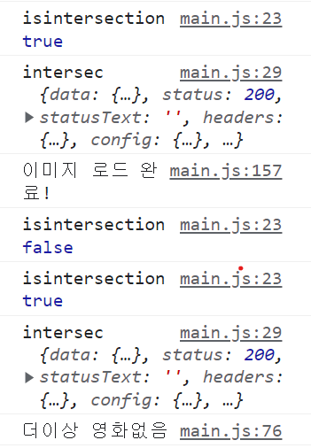

# 🎥 영화 검색 프로젝트

- 과제 기한:
  - 과제 수행 기간: 04월 28일(목) ~ 05월 19일(목)
  - 코드 리뷰 기간: 05월 19일(목) ~ 05월 20일(금)
- 내용:
  - 주어진 API를 활용해 영화 검색 프로젝트를 만들어보세요.

 <br/><br/>

## **구현한 기능 및 문제점**

<br/>

### 검색창 Enter키를 누르면 검색하는 기능

#### 문제 (해결)
form테그에 이벤트를 걸어서 click이벤트와 keydown이벤트를 한번에 받아오고 싶어 다음글을 참고했지만, 잘 되지 않았습니다. 
> 참고 블로그 : https://velog.io/@hidaehyunlee/ES2020-click-enter-%EB%91%90-%EA%B0%9C%EC%9D%98-%EC%9D%B4%EB%B2%A4%ED%8A%B8-%EB%8F%99%EC%8B%9C%EC%97%90-%EB%93%B1%EB%A1%9D%ED%95%98%EA%B8%B0
> https://www.w3schools.com/howto/howto_js_trigger_button_enter.asp
> https://okky.kr/article/679723
  
이 글을 참고해서 form안에 input태그에서 엔터를 누르면 submit이 되는 현상을 이용하고 싶었으나 실패했습니다. 
대신 두개의 addEventListener를 쓰고 겹치는 부분은 renderFirstpage함수로 따로 선언했습니다.  

:boom: [질문]: addEventListener에서 두 개의 이벤트를 동시에 감지하도록 코드를 작성할수는 없나요? 

<br/>

### :sparkles: 검색어가 없을 때 에러처리하기

#### :bug: 검색된 영화가 없는 경우 변수에 undefined 저장되는 문제 (해결)

해결 노력 1) 영화 제목을 이상하게 입력했을 때, undefined가 변수에 저장되어서 renderMovies함수와 renderFirstpage에서 forEach문을 돌때 에러가 났습니다. getapi.js에서 에러처리를 하면 될 것 같다고 생각해서 에러처리는 다음 블로그를 참고했습니다. 
> https://tuhbm.github.io/2019/03/21/axios/

```js
const fetchedData = await fetchDataByTitle(searchTextEl.value,currentPage)
const {Search: movies, totalResults :totalNumMovie} = fetchedData.data
console.log(fetchedData.data)
```

하지만 fetchDataByTitle을 변수에 할당에서 불러올때, 영화의 제목이 없는 경우에는 다음과 같은 형태의 json를 반환했습니다 

```json
{Response: 'False', Error: 'Movie not found!'}
```
아예 아무것도 반환을 못하는 것이 아니기 때문에 fetchDataByTitle에서 에러처리한 것은 소용이 없었습니다. 

해결 노력 2) api에서 Response를 먼저 판별 한 후에 true일 때 값을 받고 false일때 영화 정보가 없다는 말을 화면에 출력하도록 고쳤습니다 

#### :bug: 검색된 값이 없을 때, 이전에 검색했던 totalmovies의 값이 그대로 출력이 되는 문제 (해결)
errorMsgForNoMovie함수에 renderTotalMoviesNum(0)이렇게 호출해서 해결


### :sparkles: 최초 로딩 애니메이션 추가 
> https://m.blog.naver.com/PostView.naver?isHttpsRedirect=true&blogId=psj9102&logNo=221177093641
> https://codepen.io/demnodey/pen/YYxypL
차가 지나가는 애니메이션을 다음 사이트에서 가져와서 추가했습니다.


### :sparkles: 이미지 로딩 
이미지를불러올때 '로딩중중중'이라는 글이 출력됩니다.


### :sparkles: 무한스크롤 
명진님이 영상을 추천해 주셔서 참고해서 만들었습니다 
>https://youtu.be/hVcriryAVbg?t=1157

#### :bug: 문제 (해결)
이미지 로딩이 늦어지면 같은 이미지와 제목을 2번씩 출력하는 문제가 생김. 
more 버튼을 구현했을때 renderFirstpage()함수에서 renderMovies()로 이미지를 불러온 기능을 그대로 사용해서 observer와 renderFirstpage에서 renderMovies()가 두번 호출되서 생기는 문제였다.  observer에서만 renderMovies를 호출하도록 변경해 주었습니다. 


#### :bug: 문제 (해결 X)
* test case : 'seeyou'

1개의 영화만 검색이 될때, 
```js
if (totalNumMovie === '1'){
  renderMovies(movies,movieListEl)
  io.unobserve(fetchLoadindEl)
  noMoreMovies()
}else{
  renderMovies(movies,movieListEl)
  currentPage += 1
}
```
renderMovies(movies,movieListEl)가 실행이되어서 img요소가 삽입되고 noMoreMovies()가 실행이 되는 것이 아니라 
noMoreMovies()가 실행이되고 renderMovies(movies,movieListEl)가 실행되는 문제가 있습니다.  


검색된 값이 없을 때, 이전에 검색했던 totalmovies의 값이 그대로 출력이 됨.

1. 첫번째로 파악한 문제 원인 : 무한 스크롤에서 마지막 요소를 불러올 때 1개의 요소만 불러와서, loading중이 화면에는 있는데, isintersection은 false가 되는 문제가 있습니다. 그래서 마지막에 다시 스크롤을 올렸다가 다시 내려서 api를 불러와야지 더이상 검색된 영화가 없다는 메시지를 띄울 수 있습니다. 강사님의 경우 vue 강의에서 settimeout함수로 잠깐 깜빡이는 효과를 줘서 해결하셨는데, js로는 어떻게 구현을 해야하는지 모르겠습니다.ㅠㅠ 

2. 두번째로 파악한 문제 원인: 앞선 원인이 아니라 '로딩중중중'이라는 요소를 부모 요소에 추가하고 그 요소를 삭제한 뒤 영와정보 요소를 다시 받아오는 식으로 코드를 작성했습니다. 
제가 생각했던 순서는 '로딩중중중'삽입 -> 로딩중 삭제 -> 영화정보요소 삽입 -> 더이상 영화가 없다고 말하는 요소 삽입 입니다.
하지만 실제 실행된 순서는 '로딩중중중'삽입 -> 로딩중 삭제 -> 더이상 영화가 없다고 말하는 요소 삽입 -> 영화정보요소 삽입  
:boom: [질문]: 비동기 처리로 해결해야 하는 문제인지, 요소의 삽입 순서를 변경해서 해결해야하는 문제인지 잘 모르겠습니다 ㅠㅠ

### :sparkles: 더 이상 불러올 영화가 없음을 때 에러처리 
더 이상 불러올 영화가 없을 때, 더 이상 불러올 영화가 없다는 메시지를 출력해 줍니다. 

### :sparkles: 사용자가 입력한 값으로 영화 정보를 찾을 수 없을 때 에러 처리
사용자가 입력한 값으로 영화 정보를 찾을 수 없을 때, 사용자의 입력값과 Api로 받아온 에러 정보를 화면에 출력해 줍니다. 

### :sparkles: 사용자가 영화 제목을 입력할 때 알파벳과 숫자만 사용하도록 유도했습니다.
사용자가 한글을 입력하면 경고하도록 했습니다. 

#### :bug: 사용자가 잘못된 값을 입력했을 때도 검색이 실행되는 문제( 해결 X)
사용자가 한글을 입력한 경우에도 엔터나 검색 버튼을 누르면 검색이 실행됩니다. 찾을 수 없다는 에러를 반환하지만, 아예 검색이 안되도록 하고 싶습니다. 

### :memo: .env 파일을 만들어 key값 관리합니다. 
서버리스 함수를 사용해야 노출이 되지 않는다고 하시는데, 더 공부가 필요합니다. 

#### :bug: .env 파일에서 관리하는 값을 불러오는 경우의 문제 (공부중..) 
[ 질문 내용 ] 

안녕하세요!! 제가 .env 파일을 만들어서 사용하는데 문제가 있어서 질문을 남깁니다. 구조 분해 할당을 안하면 key가 잘 출력이 되는데
`console.log(process.env.OMDB_API_KEY)//key값 출력됨`
js 파일에서 구조분해 할당을 하면 undefined가 출력 됩니다. 혹시 이유를 알 수 있을까요? ㅠㅠ
```js
const { OMDB_API_KEY } = process.env
console.log('??',OMDB_API_KEY)//undefined
```

[ 답변 내용 ]

* 광현님의 답변

https://github.com/mrsteele/dotenv-webpack#limitations
https://github.com/mrsteele/dotenv-webpack#processenv-stubbing--replacing
https://github.com/mrsteele/dotenv-webpack/issues/70
아마 functions 가 아니라 브라우저가 로딩하는 위치에서 사용하신거 같네요.
궁금해서 찾아봤는데 정확히 이해한지는 모르겠네요.
`dotenv-webpack` 이 내부적으로  `webpack.DefinePlugin` 를 사용하고 있고 그 쪽에서 같은 이슈가 있다고 하네요.
그리고 보안 측면에서도 전역변수로 오브젝트 형식으로 볼수 있으면 문제가 됨으로
>We automatically replace any remaining `process.envs` in these environments with `"MISSING_ENV_VAR"` to avoid these errors.  

같이 간접적으로 접근할 수 없게 막아 뒀네요.

* 강사님의 답변

다영 님 안녕하세요~:윙크:
광현 님이 설명하신 게 맞아요.
아마 첫 번째 콘솔은 webpack.config.js에서 출력해 잘 되는 게 아닐까 하네요.
일단 프론트엔드에서의 환경 변수는 숨기는 용도로는 별 의미가 없어서..
서버리스 함수(백엔드)에서 사용하는 걸 인강에서 설명하고 있어요.
프론트엔드에서는 단순히 일반 변수에 Key를 지정하는 것과 환경 변수(.env)로 지정하는 것이 차이가 없습니다.


<br>
<br>


## 요구사항

### 필수 요구사항

- [x] 검색어를 입력해 영화를 검색할 수 있어야 합니다.
- [x] 검색된 결과(영화 목록)을 출력해야 합니다.
- [x] 프론트엔드 프레임워크 없이 바닐라 자바스크립트만으로 개발해야 합니다.
- [ ] 실제 서비스로 배포하고 접근 가능한 링크를 추가해야 합니다.

### 선택 요구사항

- [x] Webpack 프로젝트로 구성해보세요.
- [ ] 클라이언트에서 API Key가 노출되지 않도록 만들어보세요.
- [x] 무한 스크롤을 위한 'Intersection Observer'를 활용해보세요.
- [x] 최초 API 요청(Request)에 대한 로딩 애니메이션을 추가해보세요.
- [x] SCSS, Bootstrap 등을 구성해 프로젝트를 최대한 예쁘게(?) 만들어보세요.
- [ ] 영화 포스터 주소에 포함된 `SX300`를 `SX700`과 같이 더 큰 숫자로 수정해 요청하세요.
- [ ] 실시간으로 이미지의 크기를 다르게 요청하는 것이 어떤 원리로 가능한지 조사해보세요.
- [ ] 요청 주소에 HTTP가 아닌 HTTPS 프로토콜을 사용해야 하는 이유를 조사해보세요.

## API 사용법

- 참고 사이트: [The Open Movie Database](http://www.omdbapi.com/)
- 요청 주소: `https://www.omdbapi.com`
- Method: `GET`
- API_KEY: `7035c60c`

### 영화 목록 검색

파라미터 | 필수 | 설명 | 기본값 | 유효 값
--|--|--|--|--
`s` | 예 | 검색할 영화 제목 | |
`y` | | 영화 출시 년도 | |
`page` | | 검색 결과 페이지 | `1` | `1`~`100`

요청 예시:

```url
https://www.omdbapi.com?apikey=7035c60c&s=frozen&page=3
```

응답 예시:

- `Search`: 영화 목록, 1페이지(`page`) 당 최대 10개
- `totalResults`: 검색 가능한 모든 영화 개수

```json
{
  "Search": [
    {
      "Title": "Frozen",
      "Year": "2013",
      "imdbID": "tt2294629",
      "Type": "movie",
      "Poster": "https://m.media-amazon.com/images/M/MV5BMjA0YjYy...eQXVyNDg4NjY5OTQ@._V1_SX300.jpg"
    },
    "...최대10개"
  ],
  "totalResults": "263",
  "Response": "True"
}
```
